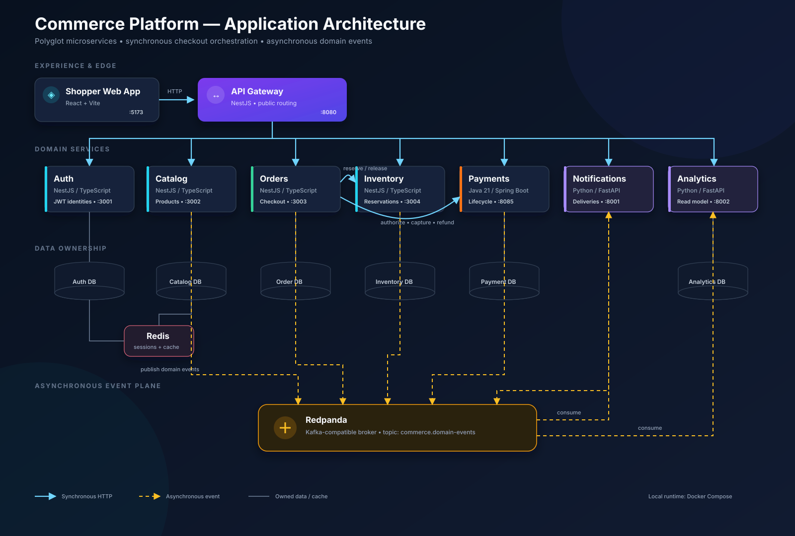
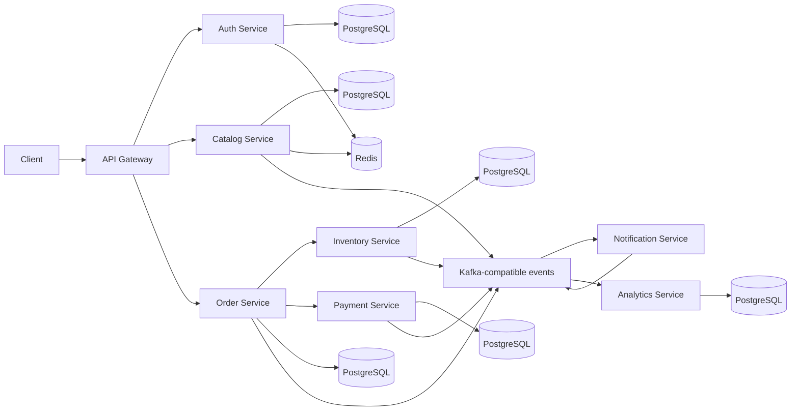

# Commerce Platform App

A portfolio-ready, polyglot microservices workload built to be reused across DevOps, platform engineering, multi-cloud, GitOps, security, and AIOps projects. This repository contains **application code only**: no cloud resources, Kubernetes, CI/CD, observability stack, or deployment platform configuration.

The application models a small but complete commerce checkout. A shopper registers, browses products, reserves inventory, places an order, completes a simulated payment, receives a simulated notification, and produces analytics events.

## Architecture



The diagram separates synchronous HTTP calls, asynchronous domain events, and service-owned data stores. The Mermaid source below provides a simplified text-renderable view of the same architecture.



| Service | Stack | Port | Responsibility |
|---|---|---:|---|
| API Gateway | TypeScript, NestJS | 8080 | Stable public entry point and routing |
| Auth | TypeScript, NestJS | 3001 | Registration, login, JWT identities, Redis session hints |
| Catalog | TypeScript, NestJS | 3002 | Product CRUD, pricing, Redis cache |
| Order | TypeScript, NestJS | 3003 | Checkout orchestration and order status |
| Inventory | TypeScript, NestJS | 3004 | Transactional stock reservation and release |
| Payment | Java 21, Spring Boot | 8085 | Simulated authorize, capture, and refund lifecycle |
| Notification | Python, FastAPI | 8001 | Event-driven simulated customer messages |
| Analytics | Python, FastAPI | 8002 | Event-consumed reporting read model |
| Web App | React, Vite | 5173 | Shopper UI for catalog, cart, checkout, notifications, and analytics |

Each data-owning service has its own PostgreSQL database. Services exchange the shared event envelope described in [docs/events.md](docs/events.md); Redpanda supplies a Kafka-compatible local broker.

Compose runs each service-owned database in a separate PostgreSQL container with its own persistent volume. The database ports are bound to `127.0.0.1` so local database tools can connect while the ports remain private when the same Compose stack runs on one EC2 instance.

| Service | PostgreSQL container | Local host port | Database |
|---|---|---:|---|
| Auth | `auth-db` | 5433 | `auth` |
| Catalog | `catalog-db` | 5434 | `catalog` |
| Inventory | `inventory-db` | 5435 | `inventory` |
| Order | `order-db` | 5436 | `orders` |
| Payment | `payment-db` | 5437 | `payments` |
| Analytics | `analytics-db` | 5438 | `analytics` |

## Run locally

Prerequisites: Docker with Compose, plus `curl` for the demo scripts.

```bash
cp .env.example .env
docker compose up --build -d
./commerce-demo/seed.sh
./commerce-demo/demo-flow.sh
```

Open the frontend at `http://localhost:5173`. The API Gateway remains available at `http://localhost:8080`.

Initial image builds can take several minutes because they compile Node, Java, and Python services. View the resulting data:

```bash
curl http://localhost:8080/api/orders -H "Authorization: Bearer YOUR_TOKEN"
curl http://localhost:8080/api/notifications/deliveries
curl http://localhost:8080/api/analytics/summary
```

Stop the application with `docker compose down`. Named database volumes preserve demo data; add `--volumes` only when you intentionally want a clean slate.

## Public routes

The gateway maps `/api/{service}` to the owning service:

- `/api/auth/register`, `/api/auth/login`, `/api/auth/me`
- `/api/catalog/products`
- `/api/inventory`, `/api/inventory/reservations`
- `/api/orders`
- `/api/payments/authorizations`, `/api/payments/payments/{id}/capture`, `/api/payments/payments/{id}/refund`
- `/api/notifications/deliveries`
- `/api/analytics/summary`, `/api/analytics/events`

The browser frontend runs separately at `/` on port `5173`.

Every service exposes `GET /health`. NestJS services expose OpenAPI JSON at `/openapi.json`; FastAPI and Spring Boot expose interactive Swagger UI at `/docs`. Spring Boot also reports health at `/actuator/health`.

## Demo behavior

The happy path is deliberately synchronous at the checkout boundary so it is easy to demonstrate and test: order → inventory reservation → payment authorization → capture → confirmed order. State changes also publish asynchronous events for notification and analytics consumers.

Use `"paymentMethod": "decline"` when creating an order to trigger a simulated payment failure. The order becomes `FAILED` and the inventory reservation is released. Cancelling a confirmed order triggers a simulated refund and releases its reservation.

## Development and tests

```bash
npm install
npm test
npm run build
npm --workspace @commerce/web-app run dev

mvn -f services/payment-service/pom.xml test

cd services/notification-service && python -m pytest
cd ../analytics-service && python -m pytest
```

Local service-specific environment examples and focused instructions live in each service directory. Database schema synchronization is enabled for this portfolio workload to keep setup approachable; a production evolution would replace it with explicit migrations.

## Container builds

Every application image uses the same simple two-stage pattern: a build stage creates the deployable artifact, and a smaller runtime stage contains only what is needed to run it.

| Services | Build stage | Runtime stage |
|---|---|---|
| API Gateway, Auth, Catalog, Orders, Inventory | Node.js installs dependencies and compiles TypeScript | Node.js runs compiled JavaScript as the non-root `node` user |
| Payment | Maven packages the Spring Boot JAR | Java 21 JRE runs the JAR as a non-root user |
| Notification, Analytics | Python creates a virtual environment and installs dependencies | Python runs Uvicorn as a non-root user |
| Web App | Node.js and Vite create static assets | Unprivileged Nginx serves the assets on container port `8080` |

Build all application images with:

```bash
docker compose build
```

The Compose frontend mapping remains `http://localhost:5173`; it maps host port `5173` to the Nginx container's port `8080`. `VITE_API_URL` is a frontend build argument because Vite embeds public configuration when it creates the static assets.

## Repository boundaries

This is the reusable workload layer. The five later portfolio projects should consume it from separate repositories and add their own infrastructure and delivery concerns. Keeping those concerns separate makes the application useful across AWS, Azure, internal-platform, multi-cloud, and incident-automation demonstrations without duplicating business code.

## CI/CD pipelines

The repository includes GitHub Actions and Jenkins pipelines. Both validate the Compose and shell configuration, run the Node, Java, and Python test suites, compile the application, build every container, start the complete stack, and exercise the seed and checkout demo. After a successful GitHub Actions smoke test on `main`, all nine application images are published to Docker Hub with both the full commit SHA and `latest` tags. Successful `main` builds can then deploy the Compose release to an Ubuntu EC2 host.

Docker Hub publishing requires these GitHub Actions repository secrets:

- `DOCKERHUB_USERNAME`: Docker Hub account or organization name
- `DOCKERHUB_TOKEN`: Docker Hub personal access token with read/write permission

Images use the repository convention `<DOCKERHUB_USERNAME>/atelier-objects-<service>`, for example `acme/atelier-objects-api-gateway:latest` and `acme/atelier-objects-api-gateway:<full-commit-sha>`.

EC2 deployment uses the `production` environment and requires these repository or environment secrets:

- `DEPLOY_HOST`: EC2 public DNS name or IP address
- `DEPLOY_USER`: SSH user, normally `ubuntu`
- `DEPLOY_SSH_KEY`: private key accepted by the host
- `DEPLOY_KNOWN_HOSTS`: trusted host-key line produced by `ssh-keyscan -H HOST`
- `VITE_API_URL`: externally reachable API URL, such as `http://example:8080`

Set the GitHub Actions repository variable `ENABLE_EC2_DEPLOYMENT` to `true` after configuring the deployment secrets. Until then, successful `main` builds stop after publishing the Docker Hub images.

Jenkins requires an agent labelled `docker` with Docker Compose, Node.js 22+, Java 21, Maven, Python 3, and `curl`. Add the EC2 private key as an SSH credential with ID `commerce-ec2-ssh`, and configure `DEPLOY_HOST`, `DEPLOY_USER`, and `VITE_API_URL`. Jenkins mirrors the GitHub guard through its `ENABLE_EC2_DEPLOYMENT` parameter. On both systems, deployment runs only for successful `main` builds when explicitly enabled.

The EC2 security group must allow SSH from the runner or Jenkins agent and ports `5173` and `8080` from the intended users. The pipelines preserve the host's `/opt/commerce-platform/current/.env`; on first deployment the bootstrap script generates its database password and JWT secret.
