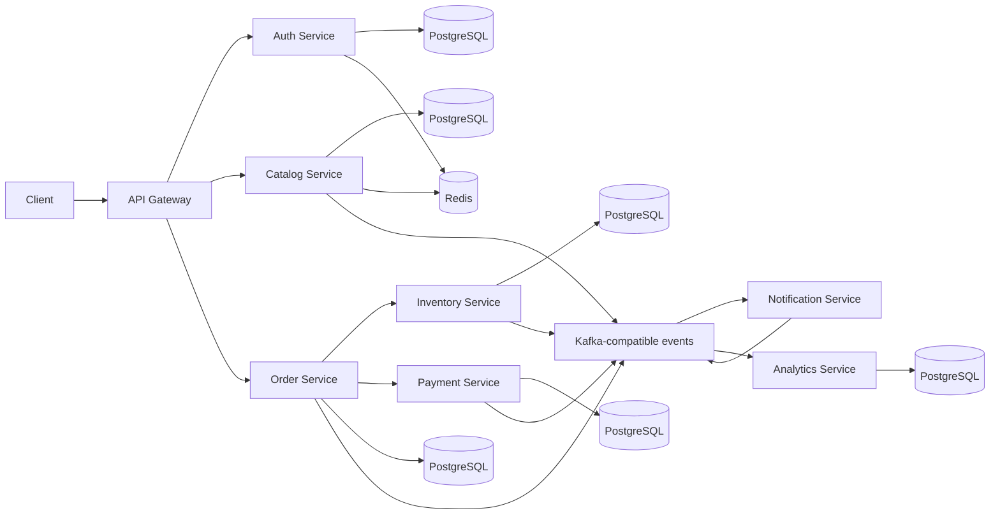

# Commerce Platform App

A portfolio-ready, polyglot microservices workload built to be reused across DevOps, platform engineering, multi-cloud, GitOps, security, and AIOps projects. This repository contains **application code only**: no cloud resources, Kubernetes, CI/CD, observability stack, or deployment platform configuration.

The application models a small but complete commerce checkout. A shopper registers, browses products, reserves inventory, places an order, completes a simulated payment, receives a simulated notification, and produces analytics events.

## Architecture



| Service | Stack | Port | Responsibility |
|---|---|---:|---|
| API Gateway | TypeScript, NestJS | 8080 | Stable public entry point and routing |
| Auth | TypeScript, NestJS | 3001 | Registration, login, JWT identities, Redis session hints |
| Catalog | TypeScript, NestJS | 3002 | Product CRUD, pricing, Redis cache |
| Order | TypeScript, NestJS | 3003 | Checkout orchestration and order status |
| Inventory | TypeScript, NestJS | 3004 | Transactional stock reservation and release |
| Payment | Java 21, Spring Boot | 8085 | Simulated authorize, capture, and refund lifecycle |
| Notification | Python, FastAPI | 8001 | Event-driven simulated customer messages |
| Analytics | Python, FastAPI | 8002 | Event-consumed reporting read model |
| Web App | React, Vite | 5173 | Shopper UI for catalog, cart, checkout, notifications, and analytics |

Each data-owning service has its own PostgreSQL database. Services exchange the shared event envelope described in [docs/events.md](docs/events.md); Redpanda supplies a Kafka-compatible local broker.

## Run locally

Prerequisites: Docker with Compose, plus `curl` for the demo scripts.

```bash
cp .env.example .env
docker compose up --build -d
./commerce-demo/seed.sh
./commerce-demo/demo-flow.sh
```

Open the frontend at `http://localhost:5173`. The API Gateway remains available at `http://localhost:8080`.

Initial image builds can take several minutes because they compile Node, Java, and Python services. View the resulting data:

```bash
curl http://localhost:8080/api/orders -H "Authorization: Bearer YOUR_TOKEN"
curl http://localhost:8080/api/notifications/deliveries
curl http://localhost:8080/api/analytics/summary
```

Stop the application with `docker compose down`. Named database volumes preserve demo data; add `--volumes` only when you intentionally want a clean slate.

## Public routes

The gateway maps `/api/{service}` to the owning service:

- `/api/auth/register`, `/api/auth/login`, `/api/auth/me`
- `/api/catalog/products`
- `/api/inventory`, `/api/inventory/reservations`
- `/api/orders`
- `/api/payments/authorizations`, `/api/payments/payments/{id}/capture`, `/api/payments/payments/{id}/refund`
- `/api/notifications/deliveries`
- `/api/analytics/summary`, `/api/analytics/events`

The browser frontend runs separately at `/` on port `5173`.

Every service exposes `GET /health`. NestJS services expose OpenAPI JSON at `/openapi.json`; FastAPI and Spring Boot expose interactive Swagger UI at `/docs`. Spring Boot also reports health at `/actuator/health`.

## Demo behavior

The happy path is deliberately synchronous at the checkout boundary so it is easy to demonstrate and test: order → inventory reservation → payment authorization → capture → confirmed order. State changes also publish asynchronous events for notification and analytics consumers.

Use `"paymentMethod": "decline"` when creating an order to trigger a simulated payment failure. The order becomes `FAILED` and the inventory reservation is released. Cancelling a confirmed order triggers a simulated refund and releases its reservation.

## Development and tests

```bash
npm install
npm test
npm run build
npm --workspace @commerce/web-app run dev

mvn -f services/payment-service/pom.xml test

cd services/notification-service && python -m pytest
cd ../analytics-service && python -m pytest
```

Local service-specific environment examples and focused instructions live in each service directory. Database schema synchronization is enabled for this portfolio workload to keep setup approachable; a production evolution would replace it with explicit migrations.

## Repository boundaries

This is the reusable workload layer. The five later portfolio projects should consume it from separate repositories and add their own infrastructure and delivery concerns. Keeping those concerns separate makes the application useful across AWS, Azure, internal-platform, multi-cloud, and incident-automation demonstrations without duplicating business code.
